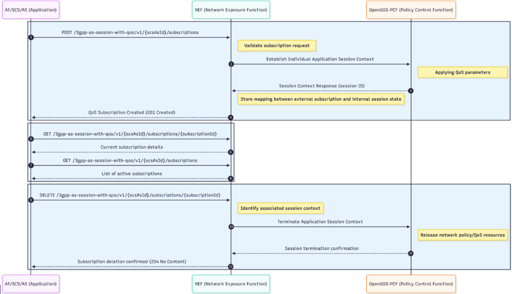

# NEF-AsSessionWithQoS

This project demonstrates the use of the **Network Exposure Function (NEF)** to interact with **Open5GS Policy Control Function (PCF)** and apply **Policy and Charging Control (PCC)** rules to manage **5G QoS (5Qi)** flows for specific subscriber sessions.

---
## AsSessionWithQoS API Description

The **AsSessionWithQoS API** enables an Application Function (AF) to establish and manage application sessions with specific Quality of Service (QoS) according to 3GPP standards. The AF typically specifies the required QoS level by indicating a **5QI (5G QoS Identifier)**, and additional policies such as bandwidth limits can also be applied. This RESTful API defines the data models, resources, and procedures for creating and managing AS sessions with required QoS ([3GPP TS 29.122, subclause 5.14.1](http://www.3gpp.org/ftp/Specs/archive/29_series/29.122/)). The session setup and policy enforcement are implemented via the PCF’s **Npcf_PolicyAuthorization** standard call, with the **NEF** mediating the request to the PCF.

Below is a sequence diagram explaining the flow in the 5G architecture:



1. **AF/SCS/AS** sends `POST /3gpp-as-session-with-qos/v1/{scsAsId}/subscriptions` to the **NEF** to create a QoS subscription.
2. **NEF** establishes an Individual Application Session Context on the **PCF**.
3. **PCF** returns the Session Context Response (session ID) to the **NEF**.
4. **NEF** replies to the **AF** with `201 Created`, confirming the QoS subscription.
5. **AF** sends `GET /3gpp-as-session-with-qos/v1/{scsAsId}/subscriptions/{subscriptionId}` to retrieve a specific subscription.
6. **NEF** returns the current subscription details to the **AF**.
7. **AF** sends `GET /3gpp-as-session-with-qos/v1/{scsAsId}/subscriptions` to list all active subscriptions.
8. **NEF** returns the list of active subscriptions to the **AF**.
9. **AF** sends `DELETE /3gpp-as-session-with-qos/v1/{scsAsId}/subscriptions/{subscriptionId}` to remove the subscription/policy.
10. **NEF** instructs the **PCF** to terminate the Application Session Context.
11. **PCF** returns session termination confirmation to the **NEF**.
12. **NEF** responds to the **AF** with `204 No Content`, confirming deletion.

Throughout this flow, the **NEF** mediates all AF interactions with the PCF, exposing simple create, read, and delete operations for managing QoS application sessions.

---

## Standards Compliance

The following 3GPP Technical Specifications (TS) are used for the implementation of the **AsSessionWithQoS API**:

- **Common Data Types**
  - Title: TS 29.122 Common Data Types
  - Version: 1.2.0-alpha.3
  - Standard 3GPP data types used in several APIs.
  - [3GPP TS 29.122 V17.2.0 T8 reference point for Northbound APIs](http://www.3gpp.org/ftp/Specs/archive/29_series/29.122/)

- **AS Session with QoS API**
  - Title: 3gpp-as-session-with-qos
  - Version: 1.2.0-alpha.1
  - API to set up an application session with required QoS.
  - [3GPP TS 29.122 V17.2.0 T8 reference point for Northbound APIs](http://www.3gpp.org/ftp/Specs/archive/29_series/29.122/)

- **Common Data Types for Service Based Interfaces**
  - Title: Common Data Types
  - Version: 1.3.0-alpha.2
  - Shared data types for 5G service-based APIs.
  - [3GPP TS 29.571 Common Data Types for Service Based Interfaces, version 17.2.0](http://www.3gpp.org/ftp/Specs/archive/29_series/29.571/)

- **PCF Policy Authorization Service API**
  - Title: Npcf_PolicyAuthorization Service API
  - Version: 1.2.0-alpha.2
  - Service for policy authorization in 5G networks.
  - [3GPP TS 29.514 V17.1.0; 5G System; Policy Authorization Service; Stage 3](http://www.3gpp.org/ftp/Specs/archive/29_series/29.514/)

---

## Functional Overview

### Northbound APIs (Exposure via NEF):

- **Create Subscription:** Create a new AsSessionWithQoS subscription.
- **List Subscriptions:** Retrieve all active subscriptions for the calling SCS/AS (or AF).
- **Retrieve Subscription:** Get the current state of a specific subscription.
- **Delete Subscription:** Terminate a subscription and release associated exposure state.

### Southbound APIs (NEF towards PCF):

- **Create Application Session Context:** Establish an Individual Application Session using parameters from the subscription.
- **Delete Application Session Context:** Terminate the corresponding application session/policy association when the subscription is deleted.

#### Northbound (Exposure via NEF)

Through the Northbound interface, an AF (or SCS/AS) declares the QoS it needs for a session by creating a subscription resource. Its purpose is to:

- Let the client create a QoS subscription representing desired service characteristics (e.g. bandwidth/5QI).
- Allow retrieval of the current subscription state.
- Enable discovery of all active subscriptions.
- Provide a clean termination mechanism that signals the end of the requested QoS intent.

#### Southbound (NEF towards PCF)

Through the Southbound interface, it takes the subscription and creates the needed policy context in the 5G core:

- On subscription creation, the NEF derives parameters and establishes an Individual Application Session Context toward the PCF for policy/QoS authorization.
- Maintains the linkage between the external subscription and the internal authorized session/policy state.
- On subscription deletion, it triggers teardown of the associated application session context to release network policy/QoS resources.

---

## Installation

### Local Installation

1. **Clone the repository:**
   ```bash
   git clone https://github.com/FRONT-research-group/NEF-QoS.git
   cd NEF-QoS
   ```
2. **Create and activate a virtual environment (recommended):**
   ```bash
   python3 -m venv venv
   source venv/bin/activate
   ```
3. **Install dependencies:**
   ```bash
   pip install -r requirements.txt
   ```
4. **Run the application:**
   ```bash
   python3 src/main.py
   ```
   The API will be available at `http://localhost:8001` by default.

### Running with Docker

1. **Build the Docker image:**
   ```bash
   docker build -t nef-qos .
   ```
2. **Run the container:**
   ```bash
   docker run -d -p 8585:8001 --name nef-qos nef-qos
   ```
   The API will be available at `http://localhost:8585`.

---

## Additional Documentation

- **API Swagger:** [ASSessionWithQoS OpenAPI (Redoc)](https://redocly.github.io/redoc/?url=https://raw.githubusercontent.com/FRONT-research-group/NEF-QoS/refs/heads/main/ASSessionWithQoS-openapi.yaml)

- **API Schemas:**
  - See the [README](src/app/schemas/README.md) file for detailed Pydantic models and schema documentation used by the API.

- **Tests:**
  - Example and integration tests are available in the [README](src/app/tests/README.md) folder. These tests demonstrate API usage and validate core logic.

---

## Contributors

- Andreas Sakellaropoulos  
  For any questions or improvements, please contact me at [asakellaropoulos@iit.demokritos.gr](mailto:asakellaropoulos@iit.demokritos.gr)

---

## Notes

- The current API was tested with Amarisoft (gNB) and Open5GS (core network). Compatibility with other 5G core or RAN vendors may require additional adaptation or validation.
- The implementation follows 3GPP standards, but some features or behaviors may depend on the specific capabilities and compliance of the tested platforms.

---

## License
This project is licensed under the Apache License 2.0.

---
